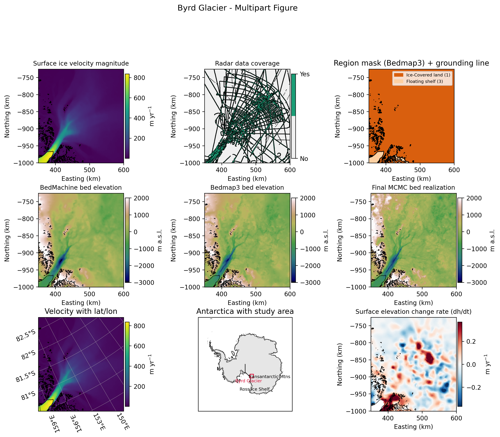
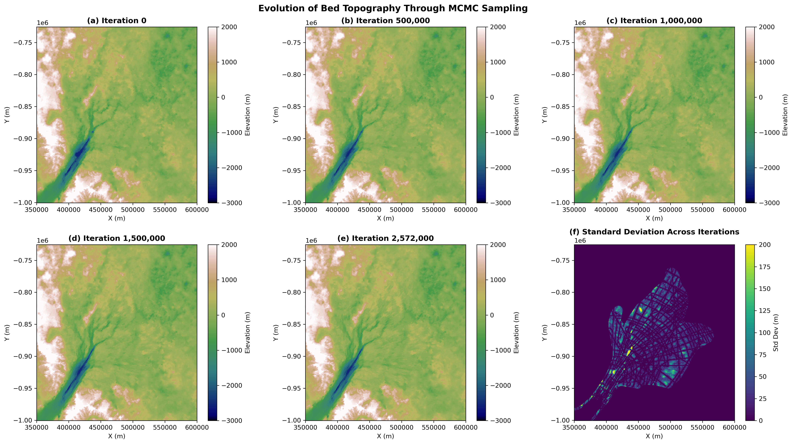
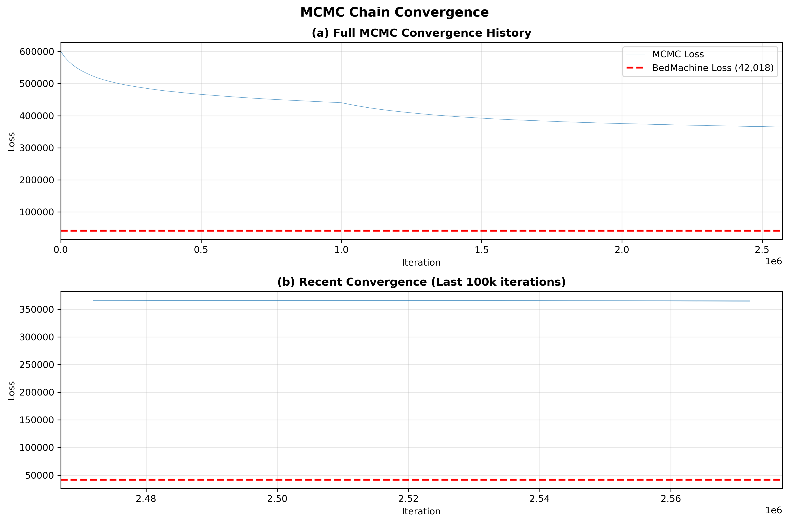

# Byrd Glacier: Geostatistical MCMC Bed Topography

> 🧊❄️ What does the bed of one of Antarctica’s fastest glaciers look like?  
> This repo tries to **x-ray Byrd Glacier’s hidden landscape** by fusing satellites, radar, and geostatistics into one mass-conserving picture of the bed. 🛰️📡📉

## 1. Project overview

This repository implements a full **geostatistical Markov Chain Monte Carlo (MCMC)** workflow to infer bed topography beneath **Byrd Glacier** ⛰️, a fast-flowing outlet that threads through the **Transantarctic Mountains** and drains grounded ice into the **Ross Ice Shelf** 🧊.

On a **500 m grid** we:

- stitch together **big Antarctic data products**  
  → 🌍 Bedmap3, 🧮 BedMachine, 🧊 MEaSUREs velocity, 🌨️ RACMO SMB, 📉 ITS_LIVE dh/dt  
- blend in **radar-derived thickness points** 🎯  
- and then use **Sequential Gaussian Simulation (SGS)** 🎲 + **MCMC** 🔁  
  to search for bed realizations that are:
  - **physically consistent** (low mass-conservation residuals in the fast trunk) ⚖️
  - **glaciologically rough** (realistic troughs, ridges, and outlets) 🌊⛰️

Think of it as:

> **“Start from a geostatistical prior → push it toward a physically consistent, mass-conserving bed while keeping it rough.”** 🧩🧊

The goals are to:

- Build a **500 m grid** of surface, thickness and bed using:
  - **Bedmap3** & compiled radar thickness
  - **BedMachine Antarctica** thickness
  - **MEaSUREs InSAR ice velocity**, **RACMO SMB**, and **ITS_LIVE dh/dt**
- Use a **Matern variogram + SGS** to generate a realistically rough prior bed
- Run a **large-scale CRF MCMC chain** to reduce **mass-conservation residuals** over the fast trunk
- Run a **small-scale SGS chain** to sharpen fine structure while preserving radar measurements
- Compare the final realization to **Bedmachine3** and **Bedmap3** in terms of:
  - Roughness / variogram
  - Mass-flux residuals
  - Visual structure (troughs, ridges, outlets)

---

## 2. Study area

- **Glacier:** Byrd Glacier  
- **Approx. lat / lon:** ~80.3° S, 159° E  
- **Projection:** Antarctic Polar Stereographic (EPSG:3031)  
- **Grid:** 500 m resolution
- High-velocity mask focuses on grounded ice with surface speed ≳ 50 m/yr, expanded and smoothed to capture the fast trunk while avoiding noisy edges.

---

## 3. Methods (high-level workflow)

1. **Data loading & gridding (File: 1. LoadData)**
   - Load:
     - Bedmap3 surface, bed, region mask
     - Compiled radar thickness (`bedmap3_raw_thick_compilation.npy`)
     - MEaSUREs InSAR velocity
     - ITS_LIVE dh/dt (2014–2016, July)
     - RACMO SMB (2014–2016 mean)
     - BedMachine thickness
   - Construct a regular 500 m grid and write **`ByrdGlacierDataGridded.csv`** with:
     - `x, y, surf, bed, velx, vely, smb, dhdt, bedmap_mask, bedmap_bed, bedmachine_thickness, highvel_mask, ...`.

2. **Conditioning and variogram** (File: 2. LargeScaleChain)
   - Define **conditioning bed** (`cond_bed`):
     - radar-derived bed where Bedmap3 mask indicates grounded ice
     - Bedmap3 bed elsewhere.
   - Normal-score transform `cond_bed` → `Nbed` using `QuantileTransformer`.
   - Compute an **isotropic Matern variogram** from sampled grounded points to set:
     - range, sill, smoothness, nugget.

3. **Sequential Gaussian Simulation (SGS) prior** (File: 2. LargeScaleChain)
   - Use `gstatsim` on the **500 m grid** to simulate **`sgsOG_bed.txt`**:
     - Rough, realistic bed conditioned to `cond_bed`.
   - Enforce physically valid thickness (no bed above surface in grounded ice).

4. **Large-scale CRF MCMC chain (`chain_crf`)** (File: 2. LargeScaleChain)
   - Initialize chain with SGS bed.
   - Use **Topography.get_mass_conservation_residual** with:
     - Bed, surface, velocity, dh/dt, SMB, resolution.
   - Loss function:
     - Sum of squared mass-flux residuals inside the **high-velocity grounded-ice mask**.
   - Proposals: **conditional random fields** (`RandField`) with:
     - Random block sizes
     - Logistic weights toward block edges & conditioning points
     - Spectral synthesis generator.
   - Run a long chain (millions of iterations), saving:
     - Selected beds (every 1000 iterations) (e.g., `bedsOG_at_2572000th_iteration`)
     - Loss and acceptance history.

5. **Small-scale SGS MCMC chain (`chain_sgs`)** (File: 3. SmallScaleChain)
   - Start from a smoothed trend of the final large-scale bed.
   - Detrend, normalize, and fit a short-range Matern variogram.
   - Run **block-update SGS** constrained to the high-velocity region, using:
     - Smaller block sizes (5–20 grid cells)
     - Same mass-conservation loss inside the trunk.
   - Save beds every 1000 iterations  
     → e.g., **`Byrd_sgs1_bed_19000.txt`** as the final realization used in plots.

6. **Figure generation** (File: 4. FigureGeneration)
   - Compose a **multi-panel figure** (`byrd_multipart_figure.png/.pdf`) including:
     - Velocity magnitude  
     - Radar coverage  
     - Bedmap3 region mask + grounding line  
     - BedMachine bed  
     - Bedmap3 bed  
     - Final MCMC bed realization  
     - Lat/lon velocity map (Cartopy)  
     - Antarctica outline with Byrd Glacier box and labels  
     - dh/dt panel.

---

## 4. Inputs & outputs (key figures)

All key figures are generated by the `2. LargeScaleChain` and `4. FigureGeneration` notebooks and saved to `bed_realizations/` and `figures/` in this repository:


  **Nine-panel summary** of the full workflow:
  - Inputs: velocity, radar, masks, dh/dt, grounding line
  - Benchmarks: Bedmap3 bed, BedMachine bed
  - Output: final small-scale MCMC bed + continental context


  Multiple bed realizations:
  - Initial SGS bed (rough, high loss)
  - 500,00th iteration large-scale bed
  - 1,000,00th iteration large-scale bed
  - 1,500,00th iteration large-scale bed
  - Final large-scale bed
  - Standard deviation map to highlight where the chain “worked.”



> The final MCMC bed retains SGS-level roughness while reducing trunk mass-conservation residuals closer to, though still above, BedMachine, suggesting a plausible but not fully converged mass-conserving configuration for Byrd Glacier.
> Ran ≈2.6 million large-scale MCMC iterations and a 20,000-step small-scale SGS refinement, perturbing blocks only inside the high-velocity trunk and accepting/rejecting with a mass-conservation loss (velocity, SMB, dh/dt) in the grounded fast-flow region.
> Mass-flux loss dropped from 601,122 (initial SGS bed) to 365,017, and extreme residuals in the trunk became smaller and less widespread.
> BedMachine v3 still has a much lower loss (42,018), so my inversion does not yet beat that reference, but relative to the initial bed it clearly moves the geostatistical prior toward a more realistic configuration. MCMC works!
> Further tuning of parameters and longer chains should keep lowering mass-flux residuals and shrinking the gap with BedMachine.


---

## 5. Repository structure

- `ByrdGlacierDataGridded.csv`  (Not included in this repo due to size. This file can be generated using the first code file: 1. LoadData.ipynb)
  
  500 m gridded dataset used for all downstream analysis.

- **Notebooks**
  - `1. LoadData.ipynb `
    Loads all raw/topographic datasets, constructs the 500 m grid and high-velocity mask, and writes `ByrdGlacierDataGridded.csv`.
  - `2. LargeScaleChain.ipynb`
    Fits Matern variogram, runs SGS to create `sgsOG_bed.txt` (or lets you simply load the file if already created), initializes `chain_crf`, runs the large-scale MCMC, and generates a summary of figures to visualize the MCMC process.
  - `3. SmallScaleChain.ipynb`
    Constructs trend, detrends, fits short-range variogram, initializes `chain_sgs`, and runs the small-scale SGS chain.
  - `4. FigureGeneration.ipynb` 
    Generates `byrd_multipart_figure.png/.pdf` 

- **Python modules**
  - `gstatsMCMC/Topography.py`  
    Helper functions to load Bedmap3, BedMachine, MEaSUREs velocity, RACMO SMB, dh/dt, and compute mass-conservation residuals.
  - `gstatsMCMC/MCMC.py`  
    Core MCMC implementation:
    - `chain_crf` (large-scale conditional random field chain)
    - `chain_sgs` (small-scale SGS chain)
    - `RandField`, `sgs`, and variogram helper functions.
  - `gstatsMCMC/gstatsim_custom/…`  
    Custom kriging and neighbor search routines used by SGS.

- **Data/outputs/misc**
  - Data: any small text arrays generated during the workflow `sgsOG_bed.txt`, `bedsOG_at_2572000th_iteration`, `Byrd_sgs1_bed_19000.txt`.
  - `figures/`:
    - `byrd_multipart_figure.png`, `byrd_multipart_figure.pdf`
  - `bed_realizations/`:
    - Additional PNGs for data, individual beds, difference maps, masks, the MCMC process, and final visualizations.
  - `GatorGlaciologyLabLogo/`:
    - `gator_lab.png` — Gator Glaciology lab logo.

- **Environment / metadata**
  - `gstatsMCMC.yml` — file with all dependencies.
  - `LICENSE` — MIT license.
  - `README.md` — this file.

---

## 6. Dependencies & installation

This project assumes a **Conda** environment compatible with the gstatsMCMC stack.

### Main Python packages

- `numpy`, `pandas`, `matplotlib`
- `scipy`, `scikit-learn`
- `xarray`, `netCDF4`
- `skgstat`, `gstools`, `gstatsim`
- `Pillow`, `opencv-python`, `tqdm`
- `cartopy`, `geopandas`, `shapely`, `cmocean`
- Local package: `gstatsMCMC` (this repo’s folder)

### Quick start

```bash
# 1. Clone the repository
git clone https://github.com/<your-username>/Byrd-Glacier-MCMC.git
cd Byrd-Glacier-MCMC

# 2. Create & activate environment
conda env create -f environment.yml
conda activate gstatsMCMC

# 3. Launch Jupyter
jupyter lab

#4. Run the code

- Open the data-loading notebook and run all cells to regenerate ByrdGlacierDataGridded.csv (or verify it).
- Run the large-scale chain notebook to generate SGS and large-scale MCMC beds.
- Run the small-scale chain notebook to generate the final Byrd_sgs1_bed_*.txt.
- Run the figure notebook to regenerate byrd_multipart_figure.png/.pdf.

⚠️ Note on large external data
The NSIDC / BedMachine / RACMO / ITS_LIVE / MOA datasets are not included in this repo due to size and licensing.
You must download them yourself and update the paths in the notebooks (e.g. ./bedmap3.nc, ./BedMachineAntarctica-v3.nc, ./moa2014_groundingline_v01/...) to match your local directory.
```

## 7. How to reuse / extend

Swap Byrd Glacier bounds for another ice stream and re-run the full workflow to explore:
- How much roughness is needed to match observed fluxes elsewhere
- Sensitivity of mass-conserving beds to SMB, dh/dt, or velocity choices

Experiment with:
- Different block sizes, range and Matern smoothness
- Including an explicit data-misfit term to radar as part of the loss
- Different high-velocity thresholds and mask smoothing settings

If you use this code or figures in future work, please acknowledge the Gator Glaciology Lab, the geostatisticalMCMC framework, and the original data providers.

---

## Poster


## 8. Data sources & acknowledgements

Built on the **Gator Glaciology** MCMC framework and datasets:

- **MCMC method & code base**  
  - Shao, N., MacKie, E., Field, M., & McCormack, F. (2025).  
    *A Markov chain Monte Carlo approach for geostatistically simulating mass-conserving subglacial topography.* Journal of Glaciology.  
  - Original code: [[Niya Shao’s geostatisticalMCMC repository]](https://github.com/NiyaShao/geostatisticalMCMC).

- **GStatSim / variogram & SGS implementation**  
  - MacKie, E., Field, M., Wang, L., Schoedl, N., & Hibbs, M. (2022).  
    *GStatSim: Sequential Gaussian Simulation.*

- **Topography datasets**
  - BedMachine Antarctica v3 — bed/surface elevation  
  - Bedmap3 — bed, surface, region mask, compiled radar thickness  
  - MEaSUREs InSAR-Based Antarctica Ice Velocity (v2)  
  - ITS_LIVE grounded ice elevation change (dh/dt)  
  - RACMO2.3p2 SMB (yearly, 1979–2016)  
  - MOA 2014 grounding line shapefile

> **Instructor / lab acknowledgements:**  
> Many thanks to **Dr. Emma MacKie**, **Niya Shao**, and the **Gator Glaciology Lab** for providing the MCMC framework, teaching materials, and datasets used in this project.

<p></p>


